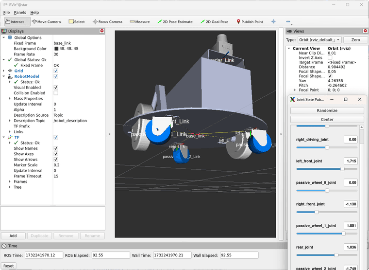
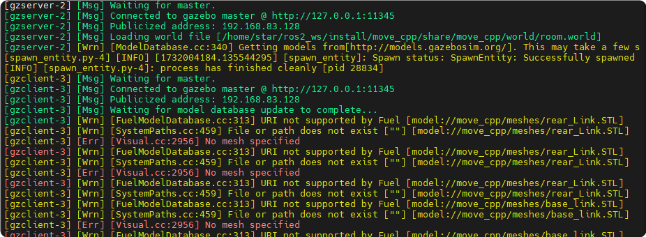
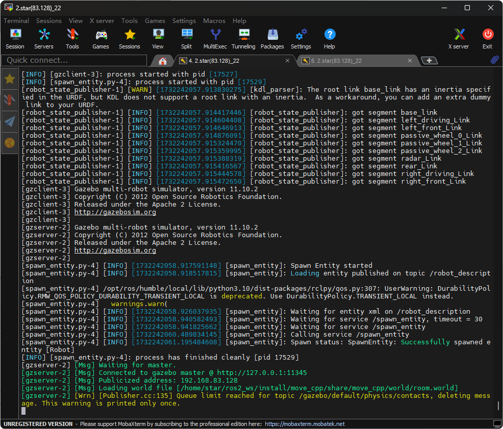
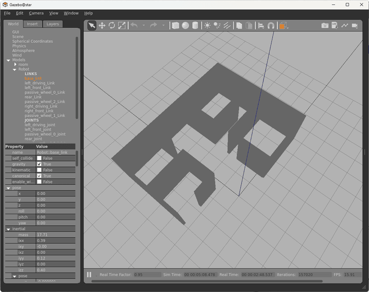
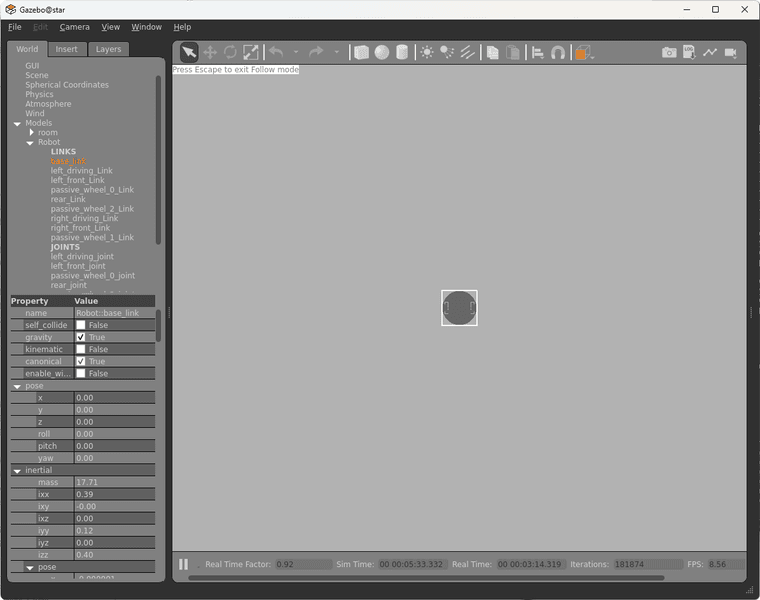

# ROS2-sw_urdf_GAZEBO
将使用sw_urdf_exporter插件导出的urdf模型加载到ROS2的GAZEBO世界中
# 启动
## robot.launch.py
该命令启动rviz并显示机器人 包含goint_gui
## gazebo_sim_launch.py
该命令启动GAZEBO并添加机器人模型，但机器人无法可视化
# 工程流程
## 鱼香ROS教程 
按照教程中的launch.py方法能够启动源urdf文件(使用solidworks插件导出)，在launch文件中加入joint_state_publisher_gui节点后，还可以对以转动的关节进行操作。

但是按照后续的教程中启动gazebo并添加机器人模型时；初期由于launch中GAZEBO_MODEL_PATH变量无法设置导致无法找到STL文件。

后放弃此思路，将模型文件路径保存到了~/.gazebo/models下后，终端不在弹出找不到STL文件的提示。在之前的某次操作中，曾在gazebo中看到了机器人模型，通体白色，但略微倾倒或零件飞出。但在后续的测试中，在终端显示已加载机器人模型和未提示找不到STL文件的情况下，

在gazebo世界中，机器人模型无法可视化。但在左侧显示栏中Models/Robot中可以显示机器人的Links和Joins，右键link或者joint的Follow可以看到机器人的外框，但是esc退出follow模式后模型恢复不可见。

# 未解决！
第一 为什么在launch定义的GAZEBO_MODEL_PATH无效。  
第二 为什么gazebo中无法可视化机器人模型。   
感谢您！！！